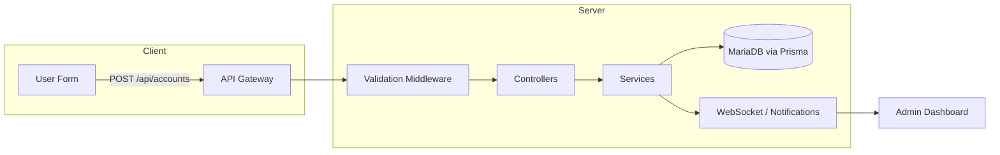

# Architecture Diagrams

High-level data flow

Component interactions

- The client speaks to server routes documented in `docs/routes.md`.
- Server services encapsulate DB and external integrations.
